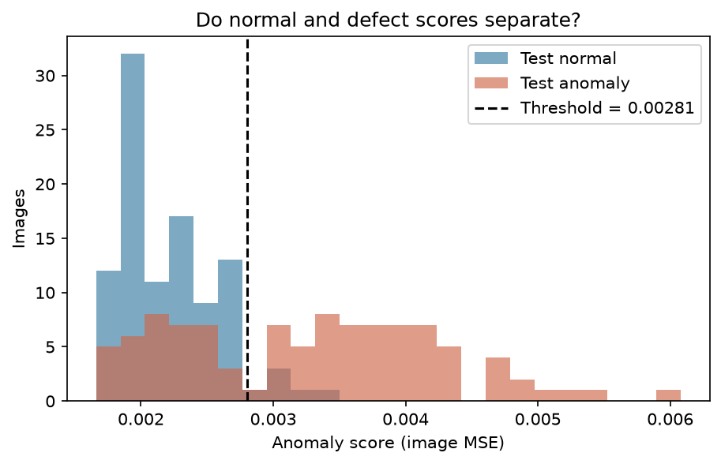

# Anomaly Detection Lab

**정상 이미지로만 학습하는 작은 AutoEncoder로, 이미지 이상탐지의 전체 과정을 배우는 실습 프로젝트입니다.**

Python과 NumPy를 써 봤지만 딥러닝 모델의 학습부터 평가까지는 처음인 학습자를 대상으로 합니다.
합성 자동차 부품 이미지를 직접 만들기 때문에 기업 데이터나 사전 학습 모델 없이 시작할 수 있습니다.

[구조와 코드 흐름](docs/ARCHITECTURE.md) · [개념 20개와 실습 6개](docs/LEARNING_GUIDE.md) ·
[실험 기록](docs/EXPERIMENTS.md) · [설명 가이드](docs/TEACHING_NOTES.md)

```text
정상 이미지 → Dataset / DataLoader → AutoEncoder 학습
새 이미지   → 복원 오차(MSE) → 정상 validation으로 정한 임계값 → 정상 / 불량 → FP·FN 분석
```

## 1. 가상환경 만들기

Python **3.10~3.12**를 준비합니다. 이 저장소를 clone하거나 ZIP으로 내려받은 뒤,
`run_pipeline.py`가 있는 폴더에서 시작하세요.

**Windows · PowerShell**

```powershell
python -m venv .venv
.\.venv\Scripts\Activate.ps1
```

**Linux · bash**

```bash
python3 -m venv .venv
source .venv/bin/activate
```

PowerShell에서 활성화가 차단되면, 아래 명령의 `python` 대신
`.\.venv\Scripts\python.exe`를 사용해도 됩니다.

## 2. 의존성 설치

```bash
python -m pip install --upgrade pip
python -m pip install -r requirements.txt
```

PyTorch · torchvision · NumPy · Pillow · matplotlib · scikit-learn을 사용합니다.
CUDA를 사용할 수 있으면 GPU, 없으면 CPU에서 실행됩니다. 설치 후 데모 실행에는 네트워크가 필요하지 않습니다.

<details>
<summary>CPU 전용 / NVIDIA GPU용 PyTorch 설치</summary>

새 가상환경에서는 아래 명령 중 자신의 환경에 맞는 것을 **requirements 설치 전에** 실행할 수 있습니다.
torch 2.7.1과 torchvision 0.22.1은 이 프로젝트에서 검증한 버전 조합입니다.

```bash
# CPU 전용
python -m pip install torch==2.7.1 torchvision==0.22.1 --index-url https://download.pytorch.org/whl/cpu

# NVIDIA GPU: CUDA 12.8을 지원하는 드라이버가 있는 환경
python -m pip install torch==2.7.1 torchvision==0.22.1 --index-url https://download.pytorch.org/whl/cu128
```

이미 다른 빌드가 설치돼 있다면 선택한 명령에 `--force-reinstall`을 추가해 교체하세요.
그다음 `python -m pip install -r requirements.txt`로 나머지를 설치합니다.
다른 CUDA 조합은 [PyTorch 공식 2.7.1 설치 안내](https://pytorch.org/get-started/previous-versions/)를 참고하세요.

</details>

## 3. 실행하기

먼저 작은 데이터와 **3 epoch**로 전체 흐름을 확인합니다.

```bash
python run_pipeline.py --smoke-test
```

이후 기본 데이터 **800장 · 15 epoch**로 실행합니다.

```bash
python run_pipeline.py
```

기본 데이터 구성은 학습 정상 500장, validation 정상 100장, test 정상/불량 각 100장입니다.
smoke test는 각각 80/20/20/20장을 사용합니다.
CPU에서는 실행 시간이 더 걸릴 수 있습니다. 모든 개별 점수는 CSV로도 남으며,
`--quiet-scores`를 붙이면 콘솔 출력을 줄일 수 있습니다.

## 4. 무엇이 만들어지나요?

- **데이터:** `data/`에 128×128 RGB 부품 이미지와 생성 조건.
- **모델:** `outputs/models/autoencoder.pt`에 가중치·해상도·임계값.
- **점수·지표:** `outputs/metrics/`에 이미지별 판정, 임계값 비교, 편차 실험 CSV와 실행 조건 JSON.
- **그림 7개:** `outputs/figures/`에 loss, 점수 분포, confusion matrix, ROC, 복원 비교, error heatmap, 정상 편차 그래프.

smoke test의 데이터와 결과는 모두 `outputs/smoke/` 아래에 따로 생성됩니다.
[결과 파일별 읽는 법](docs/ARCHITECTURE.md#outputs)과
[저장한 모델로 이미지 한 장 판정하기](docs/ARCHITECTURE.md#single-image)를 이어서 보세요.

## 5. 어떤 순서로 읽으면 좋을까요?

1. [전체 구조](docs/ARCHITECTURE.md): 이미지가 판정 결과가 되는 흐름을 먼저 봅니다.
2. [데이터 생성](src/generate_dataset.py) → [Dataset](src/dataset.py): 정상 편차와 불량, Tensor와 Batch를 구분합니다.
3. [모델](src/model.py) → [학습](src/train.py): shape 변화와 가중치 업데이트 다섯 줄을 읽습니다.
4. [추론](src/inference.py) → [임계값](src/threshold.py) → [평가](src/evaluate.py): 점수와 판정, 오검과 미검을 연결합니다.
5. [시각화](src/visualize.py) → [전체 실행](run_pipeline.py): 결과를 저장하고 해석하는 순서를 확인합니다.

모르는 개념은 [학습 가이드](docs/LEARNING_GUIDE.md)에서 찾아보고,
직접 수정한 결과는 [실험 템플릿](docs/EXPERIMENTS.md#template)에 기록하세요.
이상탐지가 처음인 스터디원이나 친구에게 설명하려면 [설명 가이드](docs/TEACHING_NOTES.md)를 참고하세요.

## 결과 미리보기

정상 이미지로 입력을 복원하도록 학습한 뒤, 이미지별 `mean((x - x_hat) ** 2)`를 점수로 사용합니다.
정상 validation 점수의 **95 percentile**보다 크면 불량으로 판정합니다.



2026-09-10의 기준 실험: 정상/불량 각 100장, seed 42, 15 epoch, RTX 4060 Laptop GPU.

- Accuracy **0.7900** · Precision **0.9143** · Recall **0.6400** · F1 **0.7529** · AUROC **0.8204**
- 정상 오검 **6장** · 불량 미검 **36장** · 임계값 **0.00280537**
- 모델 forward + MSE 평균 **1.460 ms/장**. 이미지 로딩·전처리·GPU 전송은 제외했습니다.

**구멍 누락 25장은 모두 놓쳤습니다.**
또한 정상 이미지에 밝기 편차 ±20%를 추가하자 오검률이 98%까지 올라갔습니다.
이 프로젝트에서는 잘 맞힌 결과와 함께 **어떤 가정이 실패하는지**도 관찰합니다.

[복원 비교 그림](docs/assets/sample_reconstruction.png) ·
[정상 편차 그래프](docs/assets/normal_variation.png) ·
[실험 조건과 해석](docs/EXPERIMENTS.md#reference-run) ·
[기준 지표 JSON](docs/assets/reference_metrics.json)

위 그림과 지표는 저장소에 포함된 설명용 스냅샷입니다.
직접 실행한 최신 결과는 `outputs/`에 저장되며, 장치·버전·seed에 따라 수치가 달라질 수 있습니다.

## 학습 범위

작은 Convolutional AutoEncoder와 순수 PyTorch 학습 루프로 전체 사이클을 이해하는 것이 목표입니다.
train과 validation에는 정상만 사용하고 test 정답은 평가에만 사용합니다.
정상 이미지에도 위치·회전·밝기·색·크기·잡음 편차를 넣고,
불량은 스크래치·구멍 누락·모서리 파손·얼룩 네 종류로 만듭니다.

교육용 baseline이므로 실제 제조 검사의 성능이나 처리 시간을 보장하지 않습니다.
웹 UI, API 서버, 데이터베이스, 고수준 학습 프레임워크는 사용하지 않습니다.
실제 데이터로 바꾸거나 실행 옵션을 조정하려면 [데이터·실행 안내](docs/ARCHITECTURE.md#running)를 참고하세요.
