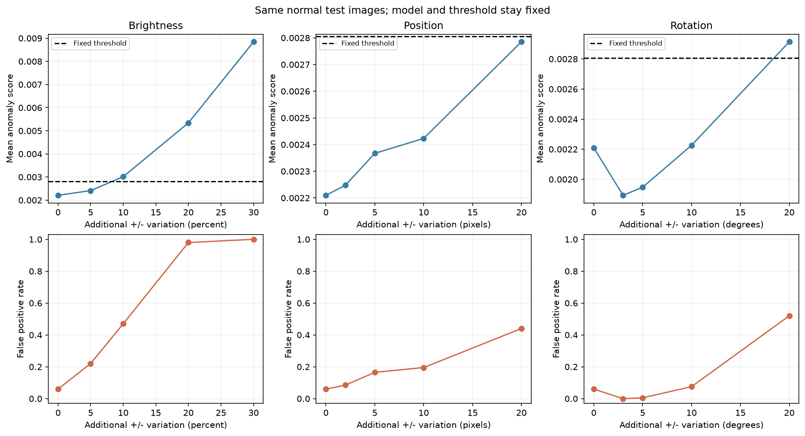

# 정상 편차 실험 기록

[README](../README.md) · [전체 구조](ARCHITECTURE.md) · [학습 가이드](LEARNING_GUIDE.md) · [실험 기록](EXPERIMENTS.md) · [설명 가이드](TEACHING_NOTES.md)

[기준 실험](#reference-run) · [재실행과 검증](#validation) · [빈 기록 템플릿](#template)

먼저 완료된 실험을 읽어 결과 해석 방식을 살펴보고, 새 실험은 아래 템플릿을 복사해 기록하세요.
가설은 실행 전에 적고, 예상과 다른 결과도 함께 남깁니다.

`assets/`의 그림과 CSV/JSON은 이 문서의 **고정된 기준 결과**입니다.
`outputs/`는 저장소에 포함되지 않으며, 직접 실행하면 자신의 결과가 생성됩니다.
파이프라인은 PNG와 CSV/JSON을 저장합니다. 콘솔 로그 파일은 자동 저장하지 않습니다.

## 실제 검증: 기본 15 epoch 실행

실행 날짜: 2026-09-10, Windows 11.
명령: `python run_pipeline.py` (프로젝트 `.venv`에서 실행).
[기준 지표 JSON](assets/reference_metrics.json) ·
[학습 loss CSV](assets/training_history.csv) · [threshold 비교 CSV](assets/threshold_comparison.csv) ·
[결함별 CSV](assets/defect_breakdown.csv) · [편차 CSV](assets/normal_variation.csv).

실행 코드 기준 커밋: `0946cfb90490fc0cbf8d6172dd1de62417b2fc0c`.
JSON 사본의 로컬 절대 경로만 프로젝트 상대 경로로 바꾸었으며, 측정값은 변경하지 않았습니다.

### 실험 목적

정상만 학습한 작은 AutoEncoder가 명확한 합성 불량을 탐지할 수 있는지 확인하고,
새로운 정상 촬영 편차가 커졌을 때 불량 오판이 늘어나는지 관찰합니다.

### 가설

학습 범위보다 큰 밝기·위치·회전 변화는 복원 오차를 키워 FPR을 증가시킬 수 있습니다.
불량은 정상보다 높은 MSE를 가질 것으로 기대하지만 모든 결함 종류에 성립하는지는 확인해야 합니다.

### 독립변수

같은 test normal 100장에 아래 변화를 종류별로 추가했습니다.

- 밝기: 0, ±5%, ±10%, ±20%, ±30%.
- 위치: 수평 이동 0, ±2px, ±5px, ±10px, ±20px.
- 회전: 0, ±3°, ±5°, ±10°, ±20°.

기본 이미지에는 이미 밝기 ±8%, 위치 각 축 ±5px, 회전 ±3° 등의 정상 편차가 있습니다.
위 수치는 원래 편차를 제거한 뒤의 절댓값이 아니라 추가 변화량입니다.

### 종속변수

평균 이미지 MSE와 FPR입니다.
0 단계에서는 정상 100장, 나머지 각 단계에서는 같은 원본의 양·음 변형 200장을 검사했습니다.
각 변형의 실제 label은 정상(0)으로 유지했습니다.
총 15개 요약 행과 2,700개 개별 관측값을 저장했습니다.

### 통제 조건

- 정상 학습 500장, validation 정상 100장, test 정상/불량 각 100장.
- 데이터와 학습 seed 42. 결함 종류별 test 이미지 25장.
- 입력 128×128 RGB, batch size 32, latent [B,64,8,8].
- 학습 가능 파라미터 214,819개. Adam lr=0.001, 15 epoch.
- validation loss가 가장 낮은 epoch 15를 사용.
- threshold: validation 정상 95 percentile = **0.0028053712**.
- 모든 편차 실험에서 모델과 threshold 고정.
- 위치/회전은 bilinear 보간, 배경은 원본 왼쪽 위 5×5 평균 RGB로 채움.
- Python 3.12.14, torch 2.7.1+cu128, torchvision 0.22.1+cu128.
- NumPy 2.5.2, Pillow 12.3.0, matplotlib 3.11.1, scikit-learn 1.9.0.
- 장치: NVIDIA GeForce RTX 4060 Laptop GPU, CUDA runtime 12.8.

### 결과

정상 학습 loss는 epoch 1의 0.084180에서 epoch 15의 0.002366으로 감소했습니다.
validation loss는 0.066358에서 0.002181로 감소했습니다.

기본 test 200장 결과:

- TP 64, TN 94, FP 6, FN 36.
- Accuracy **0.7900**, Precision **0.9143**, Recall **0.6400**.
- F1 **0.7529**, AUROC **0.8204**.
- 정상 FPR **6%**.
- 스크래치와 얼룩 Recall은 각각 1.00, 모서리 파손은 0.56, 구멍 누락은 0.00.

Threshold 비교:

- 90 percentile: threshold 0.0027237440, TP 64 / TN 92 / FP 8 / FN 36,
  Precision 0.8889, Recall 0.64, F1 0.7442, Accuracy 0.78.
- 95 percentile: threshold 0.0028053712, TP 64 / TN 94 / FP 6 / FN 36,
  Precision 0.9143, Recall 0.64, F1 0.7529, Accuracy 0.79.
- 99 percentile: threshold 0.0033749777, TP 49 / TN 100 / FP 0 / FN 51,
  Precision 1.00, Recall 0.49, F1 0.6577, Accuracy 0.745.
- 임의의 고정값 0.01: TP 0 / TN 100 / FP 0 / FN 100,
  Precision 0, Recall 0, F1 0, Accuracy 0.50.
- 같은 score를 쓰므로 모든 행의 AUROC는 0.8204로 같습니다.

정상 편차별 평균 score / FPR:

- 기준 0 변화: **0.002210 / 6%**.
- 밝기 ±5%: 0.002412 / 22%; ±10%: 0.003015 / 47%;
  ±20%: 0.005341 / 98%; ±30%: 0.008847 / 100%.
- 위치 ±2px: 0.002248 / 8.5%; ±5px: 0.002367 / 16.5%;
  ±10px: 0.002423 / 19.5%; ±20px: 0.002785 / 44%.
- 회전 ±3°: 0.001894 / 0%; ±5°: 0.001947 / 0.5%;
  ±10°: 0.002226 / 7.5%; ±20°: 0.002914 / 52%.

모델 forward + MSE의 한 장 추론 시간은 평균 **1.460 ms**, 표준편차 **0.840 ms**였습니다.
batch=1, warm-up 10회 후 50회 반복했으며 CUDA 동기화를 사용했습니다.
전체 제조 cycle time이나 CPU보다 빠른 배수를 뜻하지 않습니다.

### 해석

밝기, 큰 위치 이동, 큰 회전에서 FPR이 증가해 가설을 일부 지지했습니다.
추가 밝기 ±5%만으로도 기준 6%에서 22%로 오검이 증가했으므로,
이 모델은 정상 조명 편차에 충분히 견고하지 않습니다.

작은 회전에서는 오히려 score와 FPR이 감소했습니다.
bilinear 보간으로 경계와 잡음이 부드러워지는 것이 가능한 설명이지만,
이 실험만으로 원인을 확정할 수 없습니다. 회전과 보간 영향을 분리해 추가 확인해야 합니다.
어떤 종류의 변화든 점수가 반드시 단조 증가한다고 결론내리면 안 됩니다.

구멍 누락은 25장 모두 FN이었습니다. 복원 예시에서도 모델이 누락된 상태를 그대로 복원했습니다.
전체 이미지 평균은 국소 차이를 희석할 수도 있습니다.
이는 “정상만 학습하면 모든 불량이 큰 복원 오차를 낸다”는 가정의 한계를 보여줍니다.
정상 loss 감소만으로 이상탐지 성능을 판단하지 않아야 합니다.

99 percentile에서는 정상 FP가 0으로 줄지만 불량 FN이 51로 늘었습니다.
90과 95 사이에서는 FP만 달라지고 TP는 같았습니다.
연속적인 threshold 변화가 유한한 테스트 표본의 판정을 항상 바꾸는 것은 아닙니다.
임의의 0.01은 현재 점수 규모와 맞지 않아 불량을 하나도 잡지 못했습니다.

평균 score가 threshold보다 낮아도 일부 이미지가 threshold를 넘을 수 있습니다.
위치 ±20px에서 평균은 0.002785로 threshold 아래지만 FPR은 44%입니다.
그래서 평균만 보지 않고 분포와 FPR을 함께 확인해야 합니다.

한 seed, 같은 합성 생성기, 정상/불량 50:50 test 비율의 결과입니다.
각 변형은 같은 원본을 공유하므로 독립적인 새 표본 2,700장이 아닙니다.
심한 변형은 clipping·잘림 등의 영향도 받을 수 있습니다.
기업 데이터, 실제 허용 공차, 실제 불량 비율의 성능으로 일반화할 수 없습니다.
성능을 보고 기본값을 바꾸는 추가 튜닝은 하지 않았습니다.

## Smoke test와 추가 검증

GPU smoke:
`python run_pipeline.py --smoke-test --quiet-scores`.

- train/val/test normal/test anomaly = 80/20/20/20, 3 epoch.
- Accuracy 0.50, Precision 0.50, Recall 0.10, F1 0.1667, AUROC 0.4925.
- FP 2, FN 18. 추론 평균 0.625 ms/image (CUDA).
- 모델 저장, inference, threshold, metrics, 편차 실험, PNG 7개 생성 완료.
- 짧은 학습의 동작 검증이며 성능 기준을 만족했다는 뜻은 아닙니다.
- 재실행 결과 경로: `outputs/smoke/`.

CPU smoke:
`python run_pipeline.py --smoke-test --device cpu --epochs 2 --output-dir outputs/cpu_smoke --quiet-scores`.

- 같은 split 크기, 2 epoch.
- Accuracy 0.55, Precision 1.00, Recall 0.10, F1 0.1818, AUROC 0.5350.
- FP 0, FN 18. 추론 평균 4.135 ms/image (CPU).
- 전체 파이프라인과 PNG 7개 생성 완료.
- 재실행 결과 경로: `outputs/cpu_smoke/`.
- 학습 횟수가 다르므로 GPU smoke와 성능 우열을 비교하는 실험이 아닙니다.

독립 기대값으로 다음 8개 검증 그룹도 통과했습니다.
개발 당시의 [검증 기록 사본](assets/verification_report.json)을 포함했습니다.
이 기록은 당시 확인 결과이며, 아래 목록이 별도의 자동 테스트 명령으로 제공되는 것은 아닙니다.

1. 이미지별 MSE, score=threshold 경계 처리, percentile, 잘못된 validation score 거부.
2. 손으로 계산한 TP/TN/FP/FN 및 Precision/Recall/F1/Accuracy/AUROC와 일치.
3. 64/128 해상도와 latent 8/64 channel에서 입출력 shape·0~1 범위 확인.
4. 기본 800장의 RGB·해상도·개수 확인, 파일 내용 해시로 정확한 중복과 split 간 중복 없음 확인.
5. 생성 재현성, train 개수 변경 시 val/test 유지, 기존 데이터 보존, 불완전한 데이터에 자동 혼합 방지.
6. 저장 checkpoint 재로딩, CPU 한 장 추론과 기존 GPU score의 허용 오차 내 일치, CSV/JSON 지표 일치.
7. threshold에 따른 FP/FN 방향, AUROC 불변, 편차 2,700행 재집계와 0 변화 기준 일치.
8. 기본/GPU smoke/CPU smoke의 PNG 총 21개 정상 디코딩, 유효한 warm-up 및 시간 기록 확인.

기본 결과 PNG 7개의 배치·축·범례도 시각적으로 확인했습니다.
실제 실행 검증은 Windows에서 수행했습니다.
Linux용 경로 처리와 실행 방식도 제공하지만 이 환경에서 Linux 실행까지 확인한 것은 아닙니다.

## 다음 실험을 위한 기록 원칙

모델 구조나 학습 epoch를 비교할 때는 가능한 한 같은 test 집합을 유지하세요.
새로운 정상 편차에 대한 민감도를 재려면 모델과 threshold를 고정하고 편차 한 종류만 바꾸세요.
학습 데이터 생성 범위를 바꾸는 실험에서는 기존 생성 파일이 재사용되지 않도록 새 데이터 경로를 사용하세요.
새롭게 생성된 validation/test까지 함께 달라졌는지도 기록해야 비교를 올바르게 해석할 수 있습니다.
결과가 기대와 다르더라도 점수·FP/FN·복원 예시를 먼저 확인하고 이유를 가설로 남기세요.

## 복사해서 쓰는 실험 템플릿

### 실험 목적

- 알아보고 싶은 질문:
- 어떤 정상 편차와 실제 불량을 구분하려는가:
- 현장 정상 허용 범위가 있다면 그 근거:

### 가설

- 실행 전에 예상한 변화:
- 가설이 맞지 않았다고 판단할 관찰 결과:

### 독립변수

- 바꿀 편차 종류: brightness / position / rotation
- 각 단계와 단위:
- 기존 편차에 추가하는 양인지, 총 편차 범위인지:
- +방향/-방향 적용 방식:

### 종속변수

- 평균 anomaly score:
- False Positive Rate = FP / 정상 이미지 수:
- 필요하다면 방향별 score/FPR:

### 통제 조건

- 실행 명령과 날짜:
- 데이터 경로·생성 seed·split별 이미지 수:
- 정상 원본 이미지 목록:
- model checkpoint·선택 epoch·입력 해상도·latent shape:
- threshold와 보정에 쓴 validation 경로:
- CPU/GPU·Python·PyTorch 버전:
- 배치 크기·보간 방식·배경 채움:
- 새 학습을 했는지, 기존 모델을 고정했는지:

### 결과

각 단계마다 아래 블록을 복사합니다.

- 편차 종류와 크기:
- 정상 원본 수 / 평가한 변형본 수:
- 평균 anomaly score:
- FP 수 / FPR:
- CSV 및 그림 경로:
- 대표 FP 원본 경로와 관찰:

### 해석

- 예상한 구간과 실제 오검이 늘어난 구간:
- 결과가 가설을 지지하는지:
- 같은 현상을 설명할 다른 이유:
- 보간, 밝기 clipping, 부품 잘림, 작은 표본 등 실험의 한계:
- 이 결과만으로 말할 수 없는 것:
- 다음에 한 가지 더 바꿔 확인할 변수:
